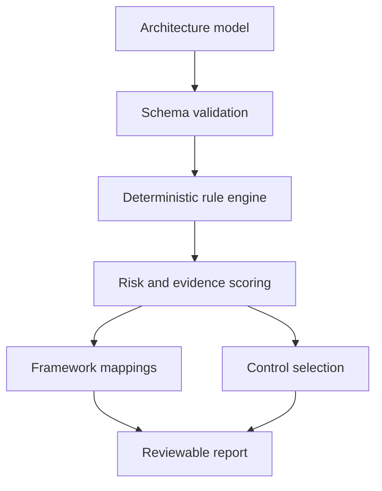

# Argus

**Evidence-backed threat modelling for software, cloud, AI and agentic systems.**

[](https://github.com/muneebch133-0/Argus/actions/workflows/ci.yml)
[](https://github.com/muneebch133-0/Argus/actions/workflows/codeql.yml)
[](LICENSE)

Argus turns an architecture diagram into reviewable threat scenarios, framework mappings, attack paths and actionable controls. It combines conventional application security with AI-specific analysis while keeping every result traceable to architecture evidence and published security frameworks.

> Argus is a decision-support tool, not a vulnerability scanner or compliance certificate. Findings identify design risk from the information supplied and require human validation.

## What it does

- Builds architecture models on an interactive drag-and-connect canvas.
- Auto-detects standard, AI and agentic system modes.
- Applies deterministic STRIDE rules to components, data flows and trust boundaries.
- Maps relevant findings to MITRE ATT&CK, MITRE ATLAS, CSA MAESTRO, OWASP LLM Top 10, OWASP Agentic Top 10 and NIST adversarial machine learning guidance.
- Produces stable finding IDs, transparent risk scores, attack paths, assumptions and confidence levels.
- Recommends controls with implementation steps and verification tests.
- Imports and exports portable JSON models and exports reports as JSON or Markdown.
- Optionally enriches explicitly supplied CVE IDs with NVD, CISA KEV and FIRST EPSS data.
- Keeps model data local by default; no LLM or external intelligence service is contacted during normal analysis.

## Supported threat knowledge

| Area | Knowledge source | How Argus uses it |
| --- | --- | --- |
| Application design | STRIDE | Primary threat categories for components and flows |
| Adversary behaviour | MITRE ATT&CK | Contextual enterprise attack-technique mappings |
| AI systems | MITRE ATLAS | Adversarial AI technique and case-study context |
| Agentic AI | CSA MAESTRO | Layered agentic-system threat context |
| LLM applications | OWASP Top 10 for LLM Applications 2025 | Prompt injection, output handling, poisoning and resource risks |
| AI agents | OWASP Top 10 for Agentic Applications 2026 | Goal hijacking, tool misuse, identity, memory and autonomy risks |
| Adversarial ML | NIST AI 100-2 E2025 | Taxonomy context for evasion, poisoning, privacy and misuse |
| Vulnerabilities | NVD, CISA KEV, FIRST EPSS | Optional evidence and prioritisation for user-supplied CVEs |

Framework mappings express relevance, not proof that a technique is feasible. Argus does not manufacture CVE associations from product names.

## Quick start

Requirements: Node.js 22 or newer and npm.

```bash
git clone https://github.com/muneebch133-0/Argus.git
cd Argus
npm ci
npm run dev
```

Open `http://localhost:5173`. The API runs on `http://localhost:8787` and the development server proxies API requests automatically.

Try the built-in **Agentic customer support** or **Payment API** models, select a node or flow to describe its security properties, and choose **Run threat analysis**.

## Production build

```bash
npm run check
npm run build
npm start
```

The production server serves both the API and the built client on `http://localhost:8787`.

### Docker

```bash
docker compose up --build
```

The supplied image uses a non-root runtime user. The Compose profile drops Linux capabilities, prevents privilege escalation and runs with a read-only filesystem.

## Analysis flow



Risk is intentionally explainable. The engine starts from likelihood and impact in each rule, then adjusts for architecture evidence such as exposure, data classification and business criticality. See [Architecture](docs/architecture.md) for the data flow and [Rule authoring](docs/rule-authoring.md) for the extension contract.

## Model important security facts

The accuracy of a threat model depends on what is represented. For each component, record its trust zone, exposure, data classification and evidenced controls. For each flow, record authentication, encryption, sensitive data, untrusted content and trust-boundary crossings.

AI and agentic components add attributes for:

- model and dataset provenance;
- prompt and content trust separation;
- retrieval and vector-store tenant isolation;
- agent memory scope and integrity;
- model-output validation before tool execution;
- least-privilege tool identities and human approval;
- circuit breakers, budgets, auditability and adversarial evaluations.

An absent control is reported as **not evidenced**, not asserted to be absent in the deployed system.

## API

### Analyse a model

```http
POST /api/analyze
Content-Type: application/json
```

```json
{
  "model": {
    "schemaVersion": "1.0",
    "name": "Example",
    "description": "A minimal service",
    "systemKind": "auto",
    "businessCriticality": "high",
    "nodes": [],
    "flows": []
  },
  "options": {
    "liveVulnerabilityEnrichment": false,
    "includeInformational": false
  }
}
```

Use the complete, valid examples in [`examples/`](examples/). The schema requires at least one node and verifies unique IDs and valid flow endpoints.

Other endpoints:

| Endpoint | Purpose |
| --- | --- |
| `GET /health` | Runtime health and version |
| `GET /api/meta` | Engine metadata and intelligence sources |
| `POST /api/intelligence/cves` | Opt-in CVE enrichment for 1–25 validated CVE IDs |

## Optional live vulnerability intelligence

Live enrichment is disabled by default because it sends requested CVE identifiers to external services.

```bash
cp .env.example .env
# Set ARGUS_LIVE_INTELLIGENCE=true
# Optionally set NVD_API_KEY for NVD rate limits
npm run dev
```

The adapter collects NVD description/CVSS/CWE data, CISA KEV status and FIRST EPSS probability. A returned record remains a **candidate** until product, version, configuration and reachability are verified. Details and interpretation rules are in [Data sources](docs/data-sources.md).

## Security and privacy

- Architecture models are stored in browser local storage unless the user exports them.
- Normal threat analysis is deterministic and makes no outbound request.
- Imported JSON is schema-validated and size-limited at the API boundary.
- The server applies a restrictive Content Security Policy and other defensive headers.
- Cross-origin API access is allowlisted with `ALLOWED_ORIGINS`.
- Live intelligence uses fixed upstream URLs, bounded CVE input and request timeouts.
- No secrets belong in architecture descriptions, exported reports or Git history.

Review the project's own [threat model](docs/threat-model.md) and [security policy](SECURITY.md) before internet-facing deployment.

## Project structure

```text
src/client/       React architecture modeller and report UI
src/engine/       Deterministic rules, scoring, controls and intelligence adapters
src/server/       Hono API, validation and production static server
src/shared/       Versioned schemas and shared types
examples/         Valid standard and agentic reference models
tests/            Engine, schema, API and intelligence tests
docs/             Architecture, sources, self-threat-model and contributor guides
```

## Current scope and roadmap

Version 0.1 is an end-to-end, single-user MVP. It does not yet include multi-user authentication, server-side projects, diagram-as-code ingestion, automated SBOM matching or an AI writing assistant. The rule engine already models AI systems; an eventual LLM assistant should explain verified results, never invent framework IDs or vulnerability evidence.

See the [roadmap](docs/roadmap.md) for planned milestones.

## Contributing

Contributions are welcome. Read [CONTRIBUTING.md](CONTRIBUTING.md) and keep new rules deterministic, evidence-backed and tested for both positive and negative cases.

## License and trademarks

Argus is available under the [MIT License](LICENSE).

MITRE, ATT&CK and ATLAS are trademarks of The MITRE Corporation. OWASP is a trademark of the OWASP Foundation. CSA and MAESTRO are associated with the Cloud Security Alliance. Argus is an independent project and is not endorsed by those organisations.
