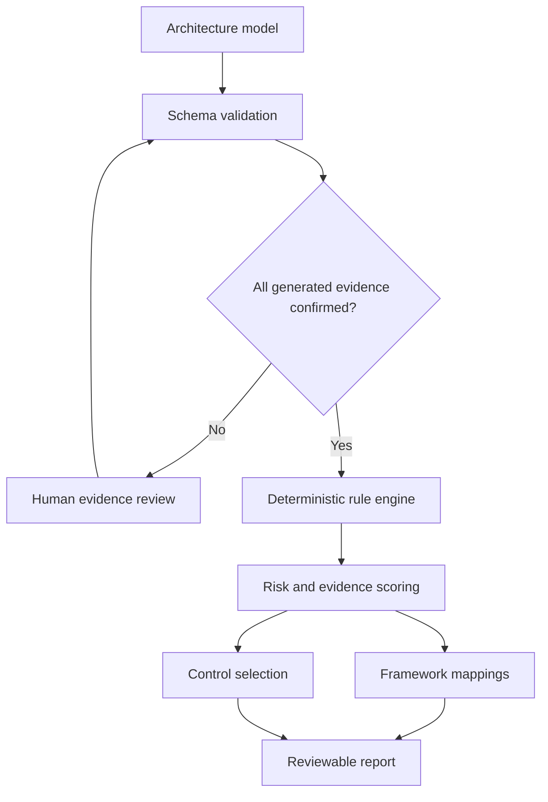

# Argus

**Evidence-backed threat modelling for software, cloud, AI and agentic systems.**

[](https://github.com/muneebch133-0/Argus/actions/workflows/ci.yml)
[](https://github.com/muneebch133-0/Argus/actions/workflows/codeql.yml)
[](LICENSE)

Argus turns an architecture diagram into reviewable threat scenarios, framework mappings, attack paths and actionable controls. It combines conventional application security with AI-specific analysis while keeping every result traceable to architecture evidence and published security frameworks.

> Argus is a decision-support tool, not a vulnerability scanner or compliance certificate. Findings identify design risk from the information supplied and require human validation.

## What it does

- Builds architecture models on an interactive drag-and-connect canvas.
- Auto-detects standard, AI and agentic system modes.
- Applies deterministic STRIDE rules to components, data flows and trust boundaries.
- Maps relevant findings to MITRE ATT&CK, MITRE ATLAS, CSA MAESTRO, OWASP LLM Top 10, OWASP Agentic Top 10 and NIST adversarial machine learning guidance.
- Produces stable finding IDs, transparent risk scores, attack paths, assumptions and confidence levels.
- Recommends controls with implementation steps and verification tests.
- Discovers draft architectures from OpenAPI, Docker Compose, Kubernetes, Terraform plans and MCP configurations.
- Guides a reviewer through a structured architecture interview for standard, AI, RAG and agentic systems.
- Preserves source locators on generated entities and blocks analysis until a human confirms the draft evidence.
- Imports and exports portable Argus JSON models and exports reports as JSON or Markdown.
- Optionally enriches explicitly supplied CVE IDs with NVD, CISA KEV and FIRST EPSS data.
- Keeps normal analysis deterministic; no LLM or external intelligence service is contacted unless separately enabled.

## Supported threat knowledge

| Area | Knowledge source | How Argus uses it |
| --- | --- | --- |
| Application design | STRIDE | Primary threat categories for components and flows |
| Adversary behaviour | MITRE ATT&CK | Contextual enterprise attack-technique mappings |
| AI systems | MITRE ATLAS | Adversarial AI technique and case-study context |
| Agentic AI | CSA MAESTRO | Layered agentic-system threat context |
| LLM applications | OWASP Top 10 for LLM Applications 2025 | Prompt injection, output handling, poisoning and resource risks |
| AI agents | OWASP Top 10 for Agentic Applications 2026 | Goal hijacking, tool misuse, identity, memory and autonomy risks |
| Adversarial ML | NIST AI 100-2 E2025 | Taxonomy context for evasion, poisoning, privacy and misuse |
| Vulnerabilities | NVD, CISA KEV, FIRST EPSS | Optional evidence and prioritisation for user-supplied CVEs |

Framework mappings express relevance, not proof that a technique is feasible. Argus does not manufacture CVE associations from product names.

## Quick start

Requirements: Node.js 22 or newer and npm.

```bash
git clone https://github.com/muneebch133-0/Argus.git
cd Argus
npm ci
npm run dev
```

Open `http://localhost:5173`. The API runs on `http://localhost:8787` and the development server proxies API requests automatically.

Try the built-in **Agentic customer support** or **Payment API** models, select a node or flow to describe its security properties, and choose **Run threat analysis**.

Use **Interview** to create a model from guided questions, or use the upload button to import an architecture file. Generated components and flows are visibly marked **Review** and cannot be analysed until their evidence has been confirmed.

## Production build

```bash
npm run check
npm run build
npm start
```

The production server serves both the API and the built client on `http://localhost:8787`.

### Docker

```bash
docker compose up --build
```

The supplied image uses a non-root runtime user. The Compose profile drops Linux capabilities, prevents privilege escalation and runs with a read-only filesystem.

Compose also starts the internal Python interview service in deterministic mode. No model provider is contacted by default.

## Architecture discovery and evidence review

Argus parses discovery files in the browser. Source files are not uploaded to the Node API or optional AI service.

| Input | Draft evidence extracted |
| --- | --- |
| OpenAPI 3 / Swagger 2 JSON or YAML | API, operations, authentication declarations and external caller flow |
| Docker Compose YAML | Services, images, networks, ports, dependencies and declared security settings |
| Kubernetes YAML | Workloads, Services, Ingress routes, images, namespaces and pod security settings |
| Terraform plan JSON | Planned resource types, locations and public-access indicators |
| MCP JSON configuration | MCP servers, command or remote transport, and environment-variable **names only** |
| Argus JSON | A validated portable model, including existing evidence and review state |

Importers describe declared configuration, not runtime truth. All inferred nodes and flows retain a source name, locator, observation and confidence. A reviewer can confirm them individually in the inspector or confirm the complete draft after review. The API independently enforces this gate with HTTP `409` if unreviewed generated evidence remains.

See [Architecture importers](docs/importers.md) for supported shapes, assumptions and security limits.

## Optional guarded AI interviewer

The guided interview works without an LLM. Its deterministic reviewer asks up to three questions about missing identity, data, agent-permission, approval and audit evidence.

An optional Python service can use [OpenAI structured output](https://developers.openai.com/api/docs/guides/structured-outputs) to improve those questions:

```bash
cp .env.example .env
# Set ARGUS_AI_PROVIDER=openai and OPENAI_API_KEY in .env
docker compose up --build
```

Only the bounded interview profile is sent to the configured provider. Imported files, the generated graph and analysis findings are not included. The service disables provider storage, exposes no model tools, validates the result with a strict Pydantic schema and falls back to deterministic questions on any provider or validation failure. AI output can ask questions; it cannot confirm evidence or add findings.

See [AI interviewer](docs/ai-interviewer.md) for configuration, privacy and trust boundaries.

## Analysis flow



Risk is intentionally explainable. The engine starts from likelihood and impact in each rule, then adjusts for architecture evidence such as exposure, data classification and business criticality. See [Architecture](docs/architecture.md) for the data flow and [Rule authoring](docs/rule-authoring.md) for the extension contract.

## Model important security facts

The accuracy of a threat model depends on what is represented. For each component, record its trust zone, exposure, data classification and evidenced controls. For each flow, record authentication, encryption, sensitive data, untrusted content and trust-boundary crossings.

AI and agentic components add attributes for:

- model and dataset provenance;
- prompt and content trust separation;
- retrieval and vector-store tenant isolation;
- agent memory scope and integrity;
- model-output validation before tool execution;
- least-privilege tool identities and human approval;
- circuit breakers, budgets, auditability and adversarial evaluations.

An absent control is reported as **not evidenced**, not asserted to be absent in the deployed system.

## API

### Analyse a model

```http
POST /api/analyze
Content-Type: application/json
```

```json
{
  "model": {
    "schemaVersion": "1.0",
    "name": "Example",
    "description": "A minimal service",
    "systemKind": "auto",
    "businessCriticality": "high",
    "nodes": [],
    "flows": []
  },
  "options": {
    "liveVulnerabilityEnrichment": false,
    "includeInformational": false
  }
}
```

Use the complete, valid examples in [`examples/`](examples/). The schema requires at least one node and verifies unique IDs and valid flow endpoints.

Other endpoints:

| Endpoint | Purpose |
| --- | --- |
| `GET /health` | Runtime health and version |
| `GET /api/meta` | Engine metadata and intelligence sources |
| `POST /api/interview/review` | Bounded architecture-profile review with deterministic fallback |
| `POST /api/intelligence/cves` | Opt-in CVE enrichment for 1–25 validated CVE IDs |

## Optional live vulnerability intelligence

Live enrichment is disabled by default because it sends requested CVE identifiers to external services.

```bash
cp .env.example .env
# Set ARGUS_LIVE_INTELLIGENCE=true
# Optionally set NVD_API_KEY for NVD rate limits
npm run dev
```

The adapter collects NVD description/CVSS/CWE data, CISA KEV status and FIRST EPSS probability. A returned record remains a **candidate** until product, version, configuration and reachability are verified. Details and interpretation rules are in [Data sources](docs/data-sources.md).

## Security and privacy

- Architecture models are stored in browser local storage unless the user exports them.
- Normal threat analysis is deterministic and makes no outbound request.
- Architecture files are parsed locally, limited to 2 MB and treated as untrusted input.
- Generated architecture evidence requires explicit human confirmation before analysis.
- The server applies a restrictive Content Security Policy and other defensive headers.
- Cross-origin API access is allowlisted with `ALLOWED_ORIGINS`.
- Live intelligence uses fixed upstream URLs, bounded CVE input and request timeouts.
- The optional AI service receives only validated interview fields, has no tools and fails closed to deterministic review.
- No secrets belong in architecture descriptions, exported reports or Git history.

Review the project's own [threat model](docs/threat-model.md) and [security policy](SECURITY.md) before internet-facing deployment.

## Project structure

```text
src/client/       React architecture modeller and report UI
src/engine/       Deterministic rules, scoring, controls and intelligence adapters
src/importers/    Browser-local OpenAPI, Compose, Kubernetes, Terraform and MCP adapters
src/interview/    Deterministic guided interview and draft builder
src/server/       Hono API, validation and production static server
src/shared/       Versioned schemas and shared types
services/ai/      Optional isolated Python/FastAPI interview assistant
examples/         Valid standard and agentic reference models
tests/            Engine, schema, API, discovery, interview and intelligence tests
docs/             Architecture, sources, self-threat-model and contributor guides
```

## Current scope and roadmap

Version 0.2 is an end-to-end, single-user release with evidence-gated architecture discovery and a guarded interview assistant. It does not include multi-user authentication, server-side projects, live cloud-account discovery or automated SBOM applicability matching. AI assistance is deliberately limited to eliciting architecture facts; the deterministic engine remains the sole source of findings, framework IDs, risk scores and controls.

See the [roadmap](docs/roadmap.md) for planned milestones.

## Contributing

Contributions are welcome. Read [CONTRIBUTING.md](CONTRIBUTING.md) and keep new rules deterministic, evidence-backed and tested for both positive and negative cases.

## License and trademarks

Argus is available under the [MIT License](LICENSE).

MITRE, ATT&CK and ATLAS are trademarks of The MITRE Corporation. OWASP is a trademark of the OWASP Foundation. CSA and MAESTRO are associated with the Cloud Security Alliance. Argus is an independent project and is not endorsed by those organisations.
