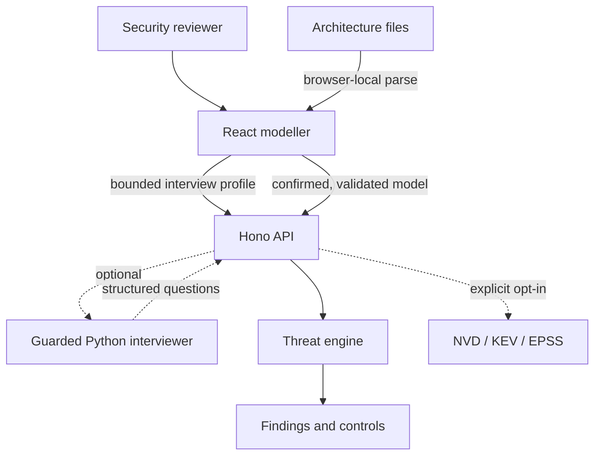

# Architecture

Argus is a local-first web application with a deterministic analysis engine. The browser is responsible for modelling, architecture discovery and report interaction; the API validates untrusted input and invokes pure analysis functions. An isolated Python service can optionally improve architecture-interview questions, but it is not part of threat analysis.

## Components

| Component | Responsibility | Trust notes |
| --- | --- | --- |
| React client | Diagram editing, evidence review, import/export and report presentation | Imports and browser storage are untrusted inputs |
| Import adapters | Local OpenAPI, Compose, Kubernetes, Terraform plan and MCP discovery | Parse but never execute input; every inference requires review |
| Interview builder | Bounded questions and evidence-labelled architecture draft | Answers are claims, not verified deployment facts |
| Shared schemas | Versioned contract and relational validation | Enforces size, type, identifier and flow-reference constraints |
| Hono API | Security headers, CORS, body limits, evidence gate and error boundaries | No authentication or multi-tenant persistence in v0.2 |
| Rule engine | Mode detection, deterministic findings and framework mappings | Must not use probabilistic output as evidence |
| Risk engine | Transparent likelihood, impact and architecture adjustments | Supports prioritisation, not actuarial loss calculation |
| Intelligence adapters | Fixed-destination NVD, CISA KEV and FIRST EPSS lookups | Disabled by default and accepts only validated CVE identifiers |
| Python interviewer | Optional schema-constrained follow-up-question generation | Internal-only, no tools, deterministic fallback, disabled by default |

## Data lifecycle

1. The user creates a model, completes the guided interview or imports a supported architecture file.
2. The browser parses files locally and creates evidence-labelled draft entities. Imported source text is not uploaded.
3. The reviewer corrects the draft and explicitly confirms every generated component and flow.
4. The current model is saved in browser local storage for convenience.
5. On analysis, the API validates the complete request and independently rejects unreviewed evidence.
6. The engine selects rules from confirmed architecture facts and returns findings and controls.
7. The user can download the model or report. Argus has no server-side project store in v0.2.

No LLM participates in the analysis flow. When enabled, the AI interviewer sees only a bounded interview profile and returns questions; it cannot write the architecture, confirm evidence or invoke the engine. Framework identifiers, evidence interpretation and vulnerability claims remain reproducible.

## Analysis contract

`SystemModel` is versioned as schema `1.0`. Models contain nodes and directed flows. Node IDs and flow IDs must be unique, and every flow endpoint must reference an existing node.

The engine returns:

- a generated analysis ID and engine version;
- detected mode and severity summary;
- findings with stable rule/entity-derived IDs;
- risk components, confidence and assumptions;
- affected entities and readable attack paths;
- framework references with versions and rationale;
- selected controls with implementation and verification guidance; and
- warnings that constrain interpretation.

## Deployment boundaries

The production Node process serves static assets and the API. The optional Python service is a separate, unprivileged, read-only container that is reachable only on the internal Compose network. The Node service uses a fixed configured URL and shared internal token; browsers cannot choose a target URL. Both services fail without writable application storage.

A real deployment should put the Node application behind authenticated TLS termination and edge rate limiting. If AI assistance is enabled, keep the Python service private, use a high-entropy internal token, store the provider key in a secret manager and restrict its outbound network access to the chosen provider.

If server-side collaboration is added later, projects, users and organisations become new high-value assets. That milestone requires a separate authentication, authorisation, encryption, tenancy and audit design review before implementation.
