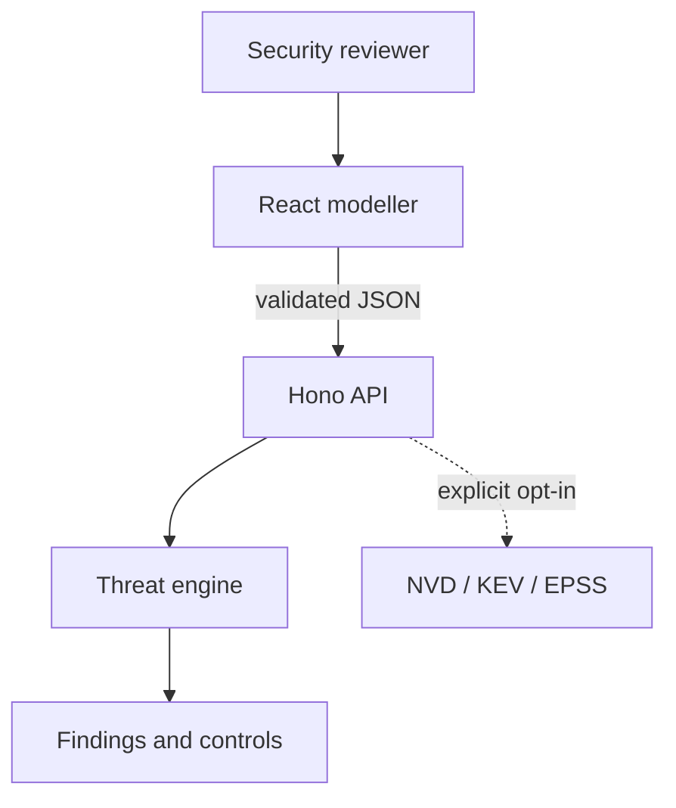

# Architecture

Argus is a local-first web application with a deterministic analysis engine. The browser is responsible for modelling and report interaction; the API validates untrusted input and invokes pure analysis functions.

## Components

| Component | Responsibility | Trust notes |
| --- | --- | --- |
| React client | Diagram editing, import/export and report presentation | Imports and browser storage are untrusted inputs |
| Shared schemas | Versioned contract and relational validation | Enforces size, type, identifier and flow-reference constraints |
| Hono API | Security headers, CORS, body limits and error boundaries | No authentication or multi-tenant persistence in v0.1 |
| Rule engine | Mode detection, deterministic findings and framework mappings | Must not use probabilistic output as evidence |
| Risk engine | Transparent likelihood, impact and architecture adjustments | Supports prioritisation, not actuarial loss calculation |
| Intelligence adapters | Fixed-destination NVD, CISA KEV and FIRST EPSS lookups | Disabled by default and accepts only validated CVE identifiers |

## Data lifecycle

1. The user creates a model or imports a JSON file.
2. The client parses the model with the same Zod schema used by the API.
3. The current model is saved in browser local storage for convenience.
4. On analysis, the API validates the complete request again.
5. The engine selects rules from architecture facts and returns findings and controls.
6. The user can download the model or report. Argus has no server-side project store in v0.1.

No LLM participates in this flow. This is intentional: framework identifiers, evidence and vulnerability claims remain reproducible. A future AI assistant may explain or help elicit architecture facts, but its output must remain separated from verified engine evidence.

## Analysis contract

`SystemModel` is versioned as schema `1.0`. Models contain nodes and directed flows. Node IDs and flow IDs must be unique, and every flow endpoint must reference an existing node.

The engine returns:

- a generated analysis ID and engine version;
- detected mode and severity summary;
- findings with stable rule/entity-derived IDs;
- risk components, confidence and assumptions;
- affected entities and readable attack paths;
- framework references with versions and rationale;
- selected controls with implementation and verification guidance; and
- warnings that constrain interpretation.

## Deployment boundaries

The production Node process serves static assets and the API. The container runs as an unprivileged user and does not require writable storage. A real deployment should put it behind authenticated TLS termination and edge rate limiting.

If server-side collaboration is added later, projects, users and organisations become new high-value assets. That milestone requires a separate authentication, authorisation, encryption, tenancy and audit design review before implementation.
